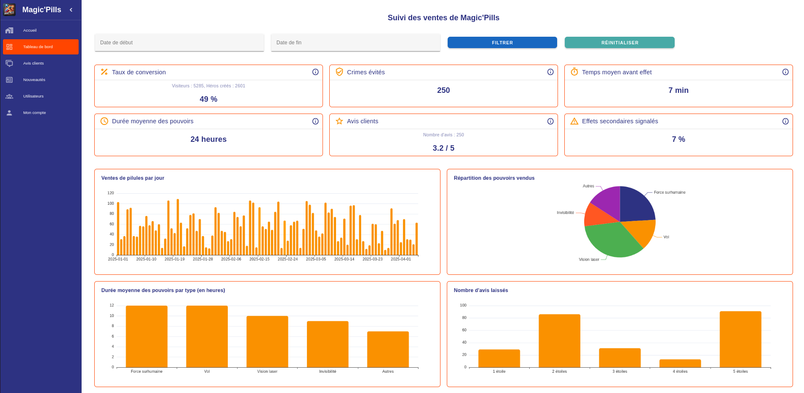

# Magic'Pills - Dashboard (Basic)

This project is designed as a **learning and practice exercise** for working with **Vue.js 3** and its ecosystem.

## Live Demo

Check out the live demo here: [Magic'Pills Dashboard](https://loic-bodolec.github.io/magicpills-dashboard/)



## Technologies Used

- **TypeScript**
- **Vue.js 3**
- **Vuetify** (UI Components)
- **Pinia** (State Management)
- **Vue-router** (Routing)
- **Echarts / Vue-echarts** (Charts and Graphs)

## Project Goals

- Learn and practice **Vue.js 3** and its ecosystem.
- Understand how to use **Pinia** for state management.
- Explore **Vuetify** for building responsive and accessible UI components.
- Implement routing with **Vue-router**.
- Integrate **Echarts** for creating dynamic and interactive charts.
- Gain experience with TypeScript in a Vue.js project.

## Recommended IDE Setup

[VSCode](https://code.visualstudio.com/) + [Volar](https://marketplace.visualstudio.com/items?itemName=Vue.volar) (and disable Vetur).

## Type Support for `.vue` Imports in TS

TypeScript cannot handle type information for `.vue` imports by default, so we replace the `tsc` CLI with `vue-tsc` for type checking. In editors, we need [Volar](https://marketplace.visualstudio.com/items?itemName=Vue.volar) to make the TypeScript language service aware of `.vue` types.

## Customize configuration

See [Vite Configuration Reference](https://vite.dev/config/).

## Project Setup

```sh
npm install
```

### Compile and Hot-Reload for Development

```sh
npm run serve
```

### Type-Check, Compile and Minify for Production

```sh
npm run build
```

### Run Unit Tests with [Vitest](https://vitest.dev/)

```sh
npm run test:unit
```

### Run End-to-End Tests with [Playwright](https://playwright.dev)

```sh
# Install browsers for the first run
npx playwright install

# When testing on CI, must build the project first
npm run build

# Runs the end-to-end tests
npm run test:e2e
# Runs the tests only on Chromium
npm run test:e2e -- --project=chromium
# Runs the tests of a specific file
npm run test:e2e -- tests/example.spec.ts
# Runs the tests in debug mode
npm run test:e2e -- --debug
```

### Lint with [ESLint](https://eslint.org/)

```sh
npm run lint
```

### TODOs

- Implement unit tests to ensure the reliability of components and logic.
- Implement end-to-end (E2E) tests to validate the user journey and interactions.
- Develop filtering functionality for dynamic data visualization based on user input.
- Add performance indicators (e.g., notifications, trend icons, etc.) to enhance the dashboard's usability.
- Integrate a back-end connection to fetch real-time data instead of using mock data.
